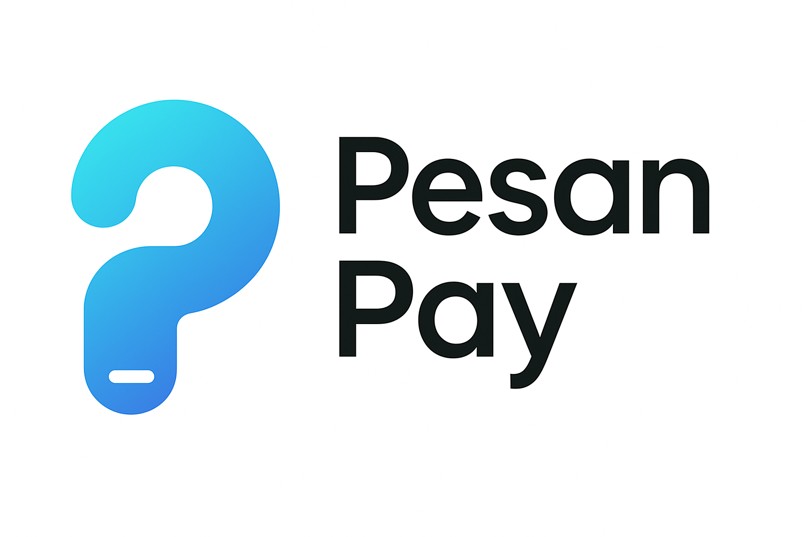
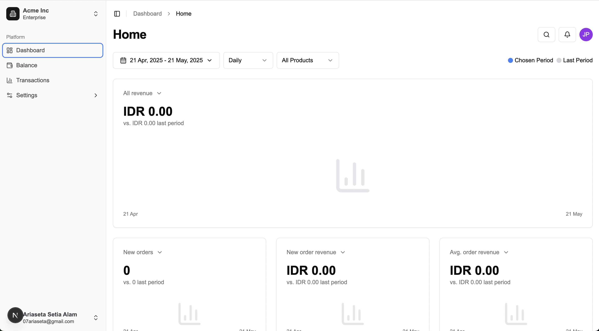

<p align="center">
  
</p>

<p align="center">
  <a href="LICENSE"></a>
  <a href="https://nextjs.org/"></a>
  <a href="https://react.dev/"></a>
  <a href="https://bun.sh/"></a>
  <a href="https://github.com/pesanio/pesan-pay/pulls"></a>
</p>

<p align="center">
  <strong>Pesan Pay</strong> is a modern payment management system designed to help businesses process, track, and manage financial transactions.
</p>

<p align="center">
  
</p>

## Features

- **Dashboard Overview**: Get a quick glance at your financial performance
- **Balance Management**: Track available and pending balances
- **Transaction History**: View and filter all payment transactions
- **Payment Processing**: Process payments via QR codes (QRIS) and other channels
- **Withdrawal Management**: Easily withdraw funds to your bank account
- **Settlement Tracking**: Monitor pending settlements and their status
- **Webhook Integration**: Receive real-time notifications for transaction events
- **API Access**: Integrate payment functionality into your applications
- **Responsive Design**: Works on desktop, tablet, and mobile devices

## Roadmap

- [x] Authentication system
- [x] Dashboard UI with charts and reports
- [x] Balance management
- [x] Transaction history
- [ ] Advanced payment analytics
- [ ] Multiple payment method integration
- [ ] Automated settlement processing
- [ ] Recurring payment support
- [ ] Refund management
- [ ] Comprehensive API documentation
- [ ] Webhook event customization
- [ ] Mobile app
- [ ] Multi-language support
- [ ] Dark mode

## Getting Started

There are two ways to use Pesan Pay:

1. Self-host the application
2. Contribute to the project development

## How to Self-Host

### Option 1: Using Bun (Recommended)

```bash
# Clone the repository
git clone https://github.com/pesanio/pesan-pay.git
cd pesan-pay

# Install dependencies
bun install

# Create environment file
cp env.example .env

# Start the development server
bun run dev
```

After running these commands:

1. **Access the Application**:
   - Open [http://localhost:3000](http://localhost:3000) in your browser
   - The application should be running with hot-reloading enabled

2. **Building for Production**:
   ```bash
   # Build the application
   bun run build

   # Start the production server
   bun run start
   ```

### Option 2: Using Docker

```bash
# Clone the repository
git clone https://github.com/pesanio/pesan-pay.git
cd pesan-pay

# Create a .env file for Docker (or use the provided example)
cp env.example .env.docker

# Build and start the Docker container
docker-compose up -d

# Access the application at http://localhost:3000
```

The Docker setup will:
- Build the application in a container
- Set up the necessary environment
- Run the application on port 3000

## Contributing

We welcome contributions! Please see our [Contributing Guide](CONTRIBUTING.md) for details.

## Tech Stack

- **Framework**: [Next.js](https://nextjs.org/) (App Router)
- **Authentication**: [Stack Auth](https://stackframe.co/)
- **UI**: [Shadcn/UI](https://ui.shadcn.com/), [Radix UI](https://www.radix-ui.com/), [Tailwind CSS](https://tailwindcss.com)
- **Data Tables**: [TanStack Table](https://tanstack.com/table/latest)
- **State Management**: React Context API
- **Runtime & Package Manager**: [Bun](https://bun.sh/)

## License

This project is licensed under the MIT License - see the [LICENSE](LICENSE) file for details.

## Acknowledgments

- [shadcn/ui](https://ui.shadcn.com/) for the beautiful UI components
- [Radix UI](https://www.radix-ui.com/) for accessible UI primitives
- [Tailwind CSS](https://tailwindcss.com/) for the utility-first CSS framework
- [Next.js](https://nextjs.org/) for the React framework
- [Stack Auth](https://stackframe.co/) for the authentication system
- [TanStack Table](https://tanstack.com/table/latest) for powerful data tables
- [Bun](https://bun.sh/) for the JavaScript runtime and package manager

##

<p align="center">Made with ❤️ by the Pesan Pay team</p>
